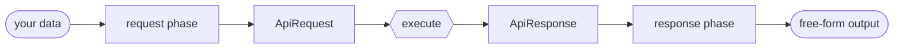

<div align="center">

# wire-jack

### One template in — a typed request out, executed, and the response reshaped back.

[](https://www.rust-lang.org)
[](#license)


[](https://github.com/sinha-sahil/temple-dsl)

[**Install**](#install) · [**Quick start**](#quick-start) · [**Writing templates**](TEMPLATES.md) · [**ApiRequest**](#apirequest) · [**ApiResponse**](#apiresponse) · [**How it works**](#how-it-works)

</div>

---

**wire-jack** turns a single [temple-dsl](https://github.com/sinha-sahil/temple-dsl) template into a complete API call. The template is the *contract*: it branches on a `phase` flag to map **both** sides of the call — your data into a typed request, and the response into whatever shape you want. You give a template and call `run`.

<table>
<tr><th>The contract — one template</th><th>In → Out</th></tr>
<tr><td>

```jsonc
{{
  input.phase == "request"
    ? { "url":     concat("https://api/users/", to_string(input.request.id)),
        "method":  "GET",
        "headers": { "Authorization": concat("Bearer ", input.request.token) } }
    : { "userId": input.response.body_json.id,
        "ok":     input.response.ok }
}}
```

</td><td>

```jsonc
// input — your data
{ "id": 42, "token": "abc" }

// output — reshaped response
{ "userId": 42, "ok": true }
```

</td></tr>
</table>



|  |  |
| --- | --- |
| 🎯 **One template** | Request *and* response mapping live in a single contract — compile once, persist the blob, render against many inputs. |
| 🧩 **Typed request** | Renders into a typed `ApiRequest`; `Content-Type` alone drives JSON / form / multipart / binary / raw encoding. |
| 🪄 **Free-form response** | The response phase reshapes the `ApiResponse` into whatever JSON shape you need. |
| 🔁 **Built-in retries** | Attempts, fixed or exponential backoff, retry-on-status — declared right in the request. |
| 🧱 **One call** | `run(&template, data)` is the entire surface. No request/response plumbing to wire up. |

---

## Install

```toml
[dependencies]
wire-jack = "0.1.0"
```

## Quick start

```rust
use wire_jack::{run, Template, Value};

let template = Template::compile(r#"{{
    input.phase == "request"
      ? {
          "url":     concat("https://api.example.com/users/", to_string(input.request.id)),
          "method":  "GET",
          "headers": { "Authorization": concat("Bearer ", input.request.token) }
        }
      : {
          "userId": input.response.body_json.id,
          "ok":     input.response.ok
        }
}}"#)?;

// Persist the compiled template (e.g. into a BYTEA/BLOB column) and reload it.
let blob = template.to_bytes();
let template = Template::from_bytes(&blob)?;

// Render the request, execute it, render the response — in one call.
let data = Value::obj([("id", Value::Int(42)), ("token", Value::Str("abc".into()))]);
let result = run(&template, data).await?;
result.output;    // free-form serde_json::Value rendered by the response phase
result.response;  // the raw ApiResponse — status, headers, body, ok
```

> [!NOTE]
> `run` is the whole API. In the **request** branch your data is at `input.request`; in the **response** branch the original request data remains at `input.request` and the [`ApiResponse`](#apiresponse) is at `input.response`. wire-jack injects the `input.phase` flag to pick the branch. The returned `RunResult` always carries the raw `ApiResponse` next to the rendered output, so 4xx/5xx details are never lost — even when the template only maps the success shape.

## Templating — phases & variables

Because the ternary short-circuits, only the active branch is evaluated. The request phase never touches `input.response`; the response phase can read both the original `input.request` and the received `input.response`.

> [!TIP]
> A top-level `let` preamble evaluates in **both** phases, so a binding that reaches a phase-specific key must use optional access from the first hop — `input?.request?.id`. For variables that should exist in **one** phase only, put a `let … in` *inside* that branch — it evaluates only when the branch is taken, so plain access is safe:

```jsonc
{{
  input.phase == "request"
    ? let path = concat("/users/", to_string(input.request.id)) in
      let auth = concat("Bearer ", input.request.token) in {
        "url":     concat(input.request.base, path),
        "headers": { "Authorization": auth }
      }
    : { "id": input.response.body_json.id }
}}
```

**See [`TEMPLATES.md`](TEMPLATES.md) for the full template-writing guide.** Runnable contracts live in [`examples/`](examples); [`tests/integration.rs`](tests/integration.rs) (mock-server backed) covers JSON / form / query / multipart / binary / method / casting / content-type fidelity.

## ApiRequest

The request the request-phase renders into. Every field has a default, so a template only sets the keys it cares about.

| Field | Type | Notes |
|---|---|---|
| `url` | `String` | **required** |
| `method` | `String` | defaults to `"GET"` |
| `headers` | `BTreeMap<String, String>` | |
| `query` | `BTreeMap<String, String>` | |
| `cookies` | `BTreeMap<String, String>` | sent as a `Cookie` header |
| `body` | `Option<serde_json::Value>` | free-form; encoding chosen by `Content-Type` ↓ |
| `auth` | `Option<Auth>` | `{ scheme, token, username, password }` — `scheme` is `"bearer"` or `"basic"` |
| `timeout_ms` | `Option<u64>` | total request timeout |
| `follow_redirects` | `Option<bool>` | |
| `max_redirects` | `Option<u32>` | |
| `proxy` | `Option<String>` | |
| `insecure` | `Option<bool>` | skip TLS verification |
| `retry` | `Option<Retry>` | `{ max_attempts, backoff, delay_ms, max_delay_ms, retry_on_status }` |

### Body encoding

The request "type" is **not** a field — it is whatever `Content-Type` says. The executor encodes `body` to match:

| `Content-Type` | Encoding |
|---|---|
| *absent* (body present) | defaults to `application/json` |
| `application/json` | JSON-serialized |
| `application/x-www-form-urlencoded` | object → `k=v&…` |
| `multipart/form-data` | object; `{ "$file": "/path" }` → file part, anything else → text part |
| binary — `application/octet-stream`, `image/*`, … | body is a base64 string, decoded to bytes |
| `text/*`, `application/xml`, … | string sent verbatim; non-string JSON-encoded |

The full content-type — parameters and all (`application/json; charset=utf-8`) — is sent verbatim, exactly once.

### Retries

`retry` drives resilience: up to `max_attempts`, retrying on a transport error or any status in `retry_on_status`, with `"fixed"` or `"exponential"` `backoff` (base `delay_ms`, capped by `max_delay_ms`).

## ApiResponse

What the response-phase template receives at `input.response`.

| Field | Type | Notes |
|---|---|---|
| `status` | `u16` | |
| `status_text` | `String` | reason phrase |
| `ok` | `bool` | `true` for 2xx |
| `headers` | `BTreeMap<String, String>` | |
| `content_type` | `Option<String>` | |
| `content_length` | `Option<u64>` | |
| `cookies` | `BTreeMap<String, String>` | from `Set-Cookie` |
| `body_text` | `Option<String>` | non-JSON text |
| `body_json` | `Option<serde_json::Value>` | parsed JSON |
| `elapsed_ms` | `u64` | |

> [!IMPORTANT]
> `body_text` and `body_json` are mutually exclusive — a JSON response fills `body_json`, other text fills `body_text`, and binary/empty bodies leave both `None`.

## How it works

| Module | Role |
|---|---|
| **`Template`** | Re-exported `temple_dsl::Template` — `compile`, `to_bytes`, `from_bytes`. The contract itself. |
| **`run`** (`src/render.rs`) | Injects the `phase` flag, renders the request into an `ApiRequest`, executes it, renders the response phase. The single public entry point. |
| **schema** (`src/request.rs`, `src/response.rs`) | `ApiRequest` (render target) and `ApiResponse`. |
| **execute** (`src/execute.rs`) | reqwest-backed — encodes by `Content-Type`, applies auth / cookies / transport options / retries, classifies the response body. |

See [temple-dsl](https://github.com/sinha-sahil/temple-dsl) for the full template language reference.

## License

MIT
